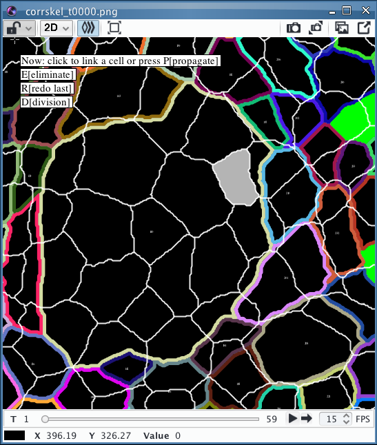
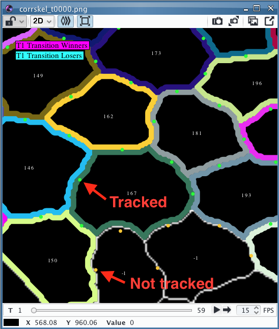

# EpiTools icy plugins for manual tracking & T1 transitions 
---

This repository contains a customized version of the EpiTools icy plugins for manually tracking cells as well as a more fine grained control of T1 transition detection. 

## Manual Tracking

### Installation

To use this version please install first the [regular version](https://github.com/epitools/epitools-icy) of our plugins and then substitute the jar file in the plugins folder with the one can find in the [release section](https://github.com/epitools/manual_tracking/releases) of this repository.

### Test data set

A test data set is provided in the release section [TrackingExample.zip](https://github.com/epitools/manual_tracking/releases) which contains a  tracking scenario for a wounding condition which is difficult to track automatically.

### Tracking Instructions

The main concept of the manual tracking plugin is that by clicking on a cell one is directly brought to the next frame where the same cell should be identified again. This step is repeated until all frames of the movie are covered or one decides to use the existing track.

Once the customized version of the plugins is installed, open icy and:

1. Run the TestLoader plugin and select the extracted TrackingExample folder
2. The test sample should be now be loaded with red overlay on top
3. Select and run the TEST overlay from the CellOverlay plugin (just scroll up in the list)
4. Upon clicking start a location has to be selected where the tracking information is saved
4. The viewer should now highlight a legend that says "Click on a cell to start tracking it"
5. Upon clicking a cell, the previous frame will be displayed:

### Special keys

* [key P] propagation will automatically propagate the new tracking to the remaining frames of the movie by using the previous tracking information starting from the current frame
* [key E] elimination will define the cell as eliminated in the current frame; if there is any tracking information for future cells from the automatic tracking, these links are now eliminated and the future cells are kept unassigned (TrackId -1).
* [key R] redo will gives the possibility to correct the last assignment made. I found this useful in case one happens to click the wrong cell
* [key D] assign a division and subsequently choose the two daughter cells 

### Saving

* The auto-save function stores the tracking information ones a track is completed (to abort one can either close the sequence and reload it for now)
* To store the entire movie with tracking information as a preset (Like For the trackingExample) an export function is available through CellExport > Preset

## T1-Transition features:

- More fine grained control in the T1 Transition overlay  
- To visually double check colored dots were added to the T1 overlay, to highlight edges that are tracked for t1s (green) and the ones that are not considered (orange). 
You may have to zoom in to spot them (see figure).

